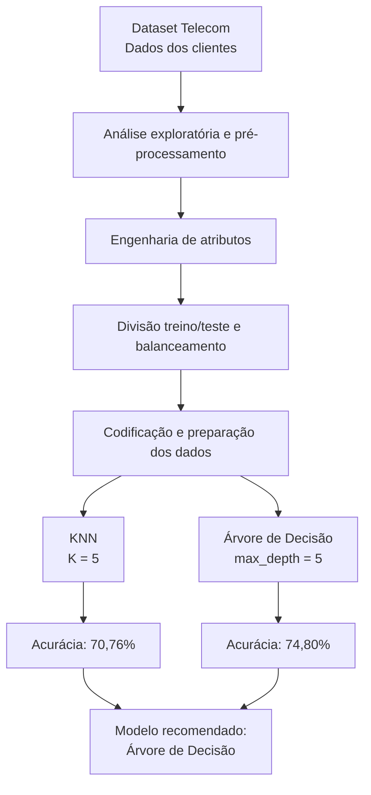
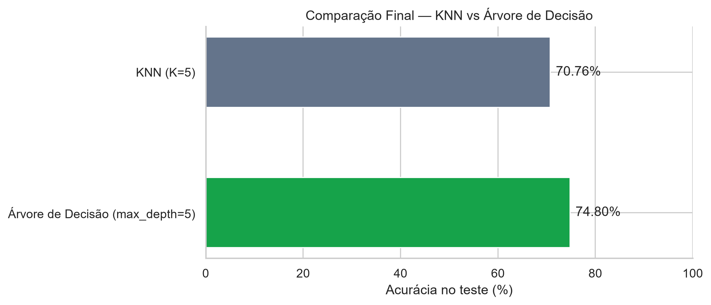

# Telecom Churn Prediction

**Sistema de previsão de cancelamento de clientes de telecomunicações utilizando Machine Learning.**

## 1. Objetivo

Desenvolver uma solução preditiva para identificar clientes com maior probabilidade de cancelar seus serviços (*churn*), auxiliando empresas de telecomunicações na tomada de decisões e na definição de estratégias de retenção.

## 2. Tecnologias utilizadas

- **Linguagem:** Python
- **Análise e manipulação de dados:** Pandas e NumPy
- **Machine Learning:** Scikit-learn
- **Visualização de dados:** Matplotlib e Seaborn
- **Desenvolvimento:** Jupyter Notebook e VS Code
- **Testes automatizados:** Pytest
- **Versionamento:** Git e GitHub

## 3. Técnicas aplicadas

- Análise exploratória de dados (EDA)
- Tratamento de valores ausentes
- Engenharia de atributos
- Codificação de variáveis categóricas com One-Hot Encoding
- Divisão estratificada em treinamento e teste
- Balanceamento de classes por undersampling
- Padronização com StandardScaler
- Classificação com K-Nearest Neighbors (KNN) e Árvore de Decisão
- Ajuste de hiperparâmetros e análise de overfitting
- Avaliação dos modelos por acurácia

## 4. Fluxo da solução

O diagrama apresenta as principais etapas do projeto, desde o carregamento dos dados até a seleção do modelo recomendado.



## 5. Resultados

Foram selecionadas as melhores configurações de cada algoritmo e comparadas suas acurácias no conjunto de teste.

| Modelo | Configuração | Acurácia |
|---|---|---:|
| KNN | K = 5 | 70,76% |
| Árvore de Decisão | max_depth = 5 | **74,80%** |

### Comparação visual



**Conclusão:** considerando a acurácia como critério de avaliação, a Árvore de Decisão apresentou o melhor desempenho, superando o KNN em 4,04 pontos percentuais.

## 6. Como executar

**1. Clone o repositório:**

```bash
git clone https://github.com/Cristina-Freitas/telecom-churn-prediction.git
```

**2. Acesse a pasta:**

```bash
cd telecom-churn-prediction
```

**3. Crie um ambiente virtual:**

```bash
python -m venv .venv
```

**4. Ative o ambiente virtual no Windows:**

```bash
.venv\Scripts\activate
```

**5. Instale as dependências:**

```bash
pip install -r requirements.txt
```

**6. Execute o projeto:**

Abra `notebooks/01_analise_exploratoria.ipynb` no VS Code ou Jupyter Notebook e execute as células em sequência.

Para executar os testes automatizados:

```bash
python -m pytest tests/ -v
```

## 7. Melhorias futuras

- Implementar validação cruzada para seleção dos hiperparâmetros.
- Avaliar métricas adicionais, como precisão, recall e F1-score.
- Testar outros algoritmos de classificação.
- Desenvolver uma interface para previsão de churn de novos clientes.

## 8. Documentação técnica

As principais decisões de arquitetura, preparação dos dados, modelagem e avaliação estão registradas no documento complementar:

[Documentação Técnica — Telecom Churn Prediction](documentacao_tecnica_telecom_churn.md)

## 9. Autoria

**Cristina Freitas**

Projeto desenvolvido como atividade prática de Machine Learning na formação em Desenvolvimento de IA para Análise Preditiva, no programa **SCTEC.**

